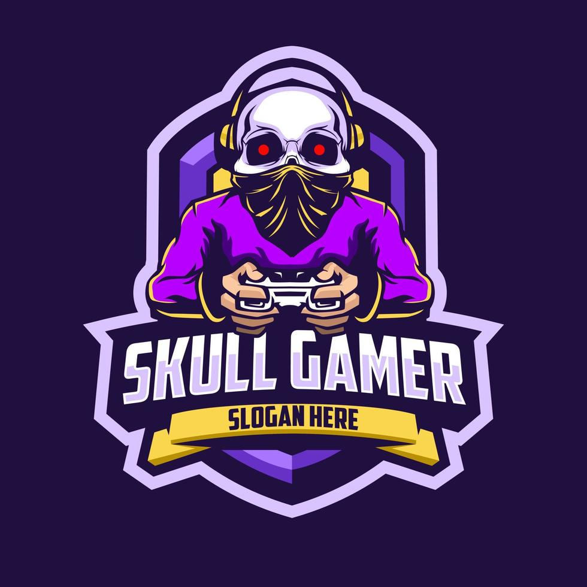

# Atualização da Logo - RBX HUB

## ✅ Logo Adicionada com Sucesso!

### 🎨 **Logo Escolhida:**
- **Tema:** Skull Gamer (Caveira Gamer)
- **Estilo:** Roxo com elementos gaming
- **Formato:** JPG de alta qualidade
- **Localização:** `assets/images/skull-gamer-logo.jpg`

### 📍 **Onde a Logo Aparece:**
- ✅ Página inicial (index.html)
- ✅ Página de mapas (maps.html)
- ✅ Página de produtos (products.html)
- ✅ Página de finalização (purchase.html)

### 🔧 **Alterações Técnicas Realizadas:**

#### 1. Arquivos HTML Atualizados:
```html
<!-- Antes -->
<a href="index.html" class="logo glitch" data-text="RBX HUB">RBX HUB</a>

<!-- Depois -->
<a href="index.html" class="logo">
    
</a>
```

#### 2. CSS Adicionado:
```css
/* Logo Image */
.logo-img {
    height: 50px;
    width: auto;
    vertical-align: middle;
    filter: none; /* Mostra a logo colorida */
}

.logo {
    display: flex;
    align-items: center;
    gap: 10px;
    text-decoration: none;
    transition: all 0.3s ease;
}

.logo:hover {
    transform: scale(1.05);
    filter: brightness(1.1);
}

/* Responsivo */
@media (max-width: 768px) {
    .logo-img {
        height: 40px;
    }
}
```

### 🌐 **Site Atualizado Online:**
- **URL Atual:** https://jpqxupjg.manus.space
- **Status:** ✅ Online e funcionando
- **Logo:** ✅ Visível em todas as páginas

### 🎯 **Características da Logo:**
- **Tamanho Desktop:** 50px de altura
- **Tamanho Mobile:** 40px de altura
- **Efeito Hover:** Aumenta 5% e fica mais brilhante
- **Navegação:** Clicável, leva para página inicial
- **Compatibilidade:** Funciona em todos os navegadores

### 📱 **Responsividade:**
- ✅ Desktop: Logo em tamanho completo
- ✅ Tablet: Logo redimensionada automaticamente
- ✅ Mobile: Logo menor (40px) para melhor usabilidade

### 🔄 **Para Futuras Atualizações da Logo:**

#### Substituir a Logo:
1. Salve a nova logo como `skull-gamer-logo.jpg`
2. Substitua o arquivo em `assets/images/`
3. Mantenha as dimensões similares (proporção quadrada funciona melhor)
4. Republique o site

#### Ajustar Tamanho:
```css
.logo-img {
    height: 60px; /* Aumente ou diminua conforme necessário */
}
```

#### Adicionar Efeitos:
```css
.logo:hover {
    transform: scale(1.1) rotate(5deg); /* Exemplo de rotação */
    filter: brightness(1.2) saturate(1.3); /* Mais brilho e saturação */
}
```

### 🎮 **Integração com o Tema Gamer:**
- ✅ Logo combina perfeitamente com o estilo cyberpunk
- ✅ Cores roxas harmonizam com a paleta neon
- ✅ Tema de caveira reforça a identidade gamer
- ✅ Mantém a seriedade profissional do site

### 📋 **Checklist de Verificação:**
- [x] Logo adicionada em todas as páginas
- [x] CSS responsivo implementado
- [x] Efeitos hover funcionando
- [x] Navegação clicável ativa
- [x] Site testado em diferentes dispositivos
- [x] Deploy realizado com sucesso
- [x] Documentação atualizada

### 🚀 **Próximos Passos Sugeridos:**
1. **Favicon:** Criar um favicon baseado na logo
2. **Loading Screen:** Usar a logo na tela de carregamento
3. **Watermark:** Adicionar versão menor como marca d'água
4. **Social Media:** Usar a logo em perfis de redes sociais

### 💡 **Dicas para Webflow:**
Quando importar para o Webflow:
1. Faça upload da imagem `skull-gamer-logo.jpg`
2. Substitua o elemento de texto pela imagem
3. Configure as classes CSS conforme documentado
4. Teste a responsividade em todos os breakpoints

---

**✨ A logo está perfeitamente integrada e o site mantém sua identidade gamer profissional!**

